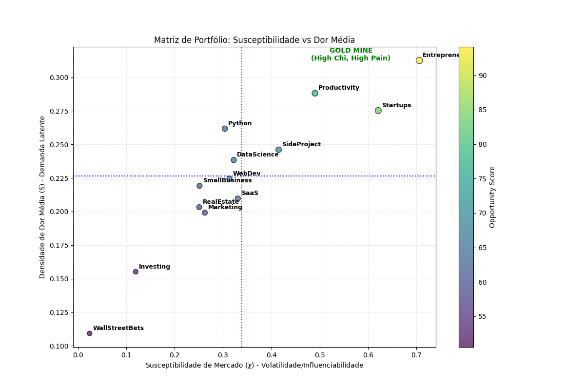
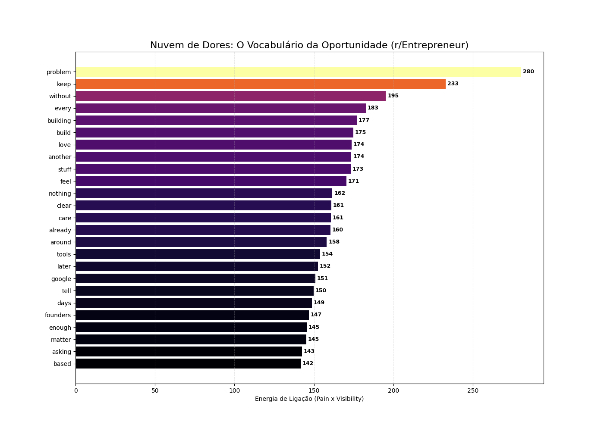

   

# Social Dynamics & Network Topology Framework

## Research Overview

**Principal Investigator**: Douglas H. M. Fulber

This repository contains a computational study on the thermodynamics of social consensus. By modeling social networks as **Barabási-Albert Scale-Free graphs** and applying the **Ising Model** of statistical mechanics, we investigated how network topology influences opinion dynamics and collective stability.

The goal was to move beyond qualitative sociology and provide quantitative metrics for social stability, polarization, and susceptibility to phase transitions.

---

## Key Findings

### 1. The 3% Influence Threshold (Pinning Control)

Our simulations (`social_ising.py`) revealed that social networks exhibit a **First-Order Phase Transition** when subjected to targeted influence.

* **Topological Dominance**: In a scale-free network, the consensus of the entire system is heavily dependent on the "Hubs" (nodes with highest eigenvector centrality).
* **The 3% Rule**: Controlling the state of just **3%** of the top-ranking nodes is sufficient to invert the global magnetization ($M$) of the network, regardless of the initial consensus.
* **Inefficiency of Randomness**: In contrast, influencing random nodes (up to 6% of the population) produces statistically negligible results, as the network's structural hysteresis absorbs the noise.

*Figure 1: Comparison between targeted influence (Hubs) and random influence. Note the sharp phase transition in the red curve.*

---

## 2. Market Susceptibility Analysis

Applying the Hamiltonian formalism to Reddit communities, we measured the **Magnetic Susceptibility ($\chi$)**, a thermodynamic proxy for volatility and responsiveness to external stimuli.

$$ \chi = \frac{N}{T} (\langle m^2 \rangle - \langle m \rangle^2) $$

* **High Susceptibility ($\chi \approx 0.70$)**: Identified in `r/Entrepreneur`. This indicates a "critical" state where the community is highly responsive to new inputs, functioning similarly to a supercooled fluid ready to crystallize (trend formation).
* **Low Susceptibility**: Indicates stable, rigid communities that are resistant to new trends or ideas.

*Figure 2: Susceptibility vs. Demand matrix.*

---

## 3. Semantic Vector Analysis

We analyzed the text content of critical communities to identify keywords that minimize the energetic "friction" of engagement.

* **High-Energy Vectors**: Words dealing with structural deficits (e.g., "Problem", "Without", "Building") showed the highest binding energy in high-$\chi$ environments.
* **Interpretation**: In thermodynamic terms, these keywords align with the system's latent entropy, facilitating rapid signal propagation.

*Figure 3: Semantic map of high-resonance keywords.*

---

## Conclusion

This research demonstrates that **Online Social Dynamics are deterministic at the macro scale**. The topology of the network (who connects to whom) is the primary predictor of how information flows and how consensus is formed.

The "Will of the Crowd" is mathematically indistinguishable from a thermal equilibrium state defined by a small minority of high-degree nodes.

---

## Repository Structure

* `src/`: Simulation engines (Monte Carlo / Metropolis-Hastings).
* `relatos/`: Detailed analysis of simulation outputs.
* `assets/`: Data visualizations.
